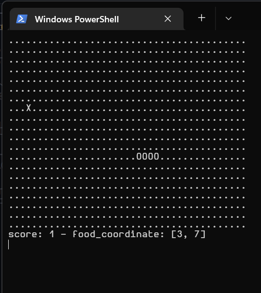

# Simple Terminal Snake Game (Python 3)
<p align="center">
  
</p>

this is my first python project i try to make without using any tutorials. this is a simple terminal game with minimal external python library. Don't expect anything fancy here like _clean code_ or something, I'm a bit lazy to do that


essential external python library that i'm used tn this repo: 
- `pyinstaller` for creating executable file
- `keybord` for receiving continous input from keyboard

## Requirements
just python3, and a terminal

## Environment Setup:
```
pip install -r requirements.txt
```
and just run it into terminal (`python3` user):
``` 
python3 snake_game.py
```
you can also run this command if your default `python --version` is python 3.xx
```
python snake_game.py
```